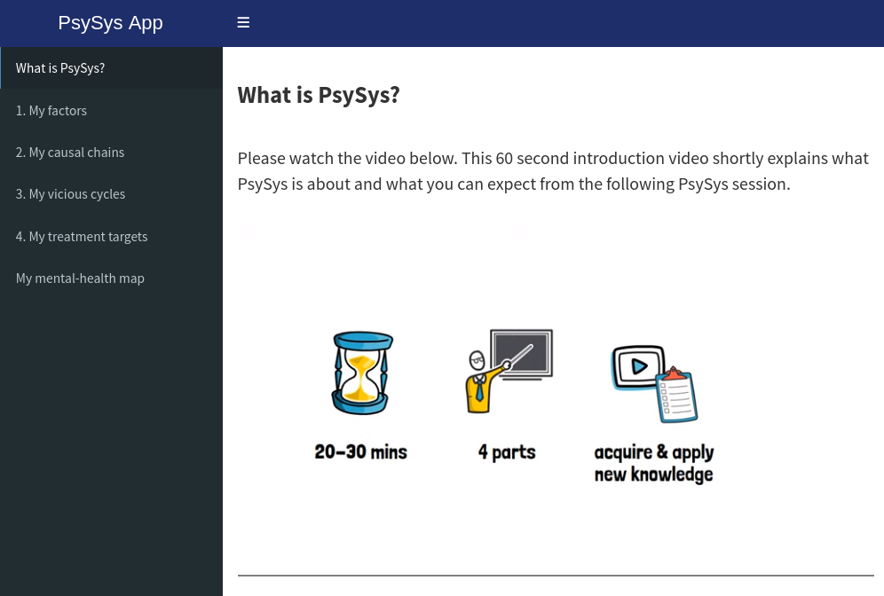
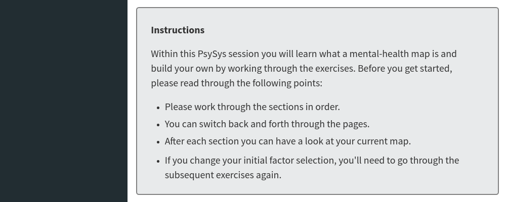
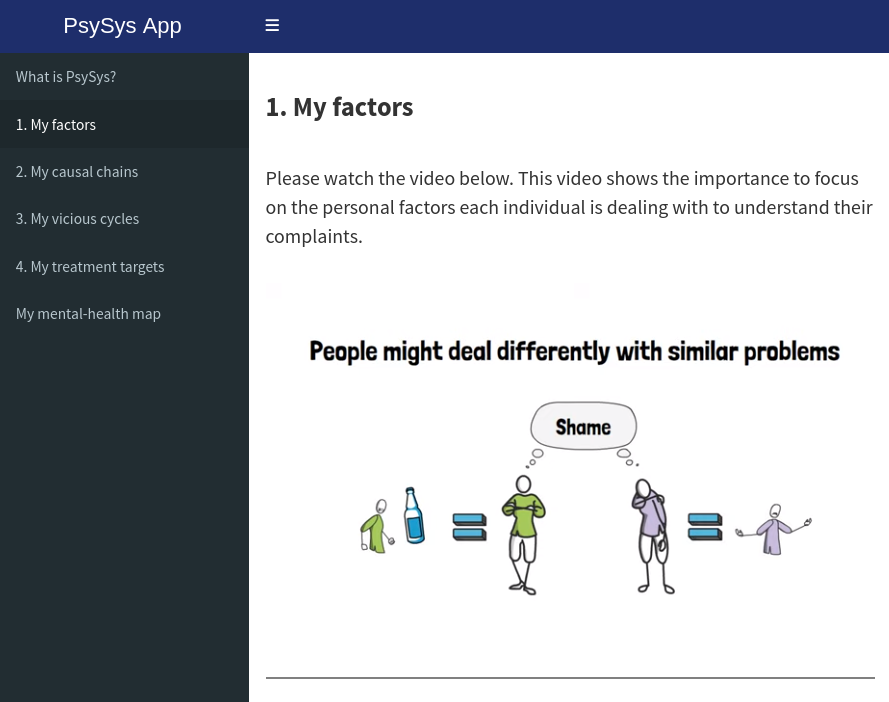
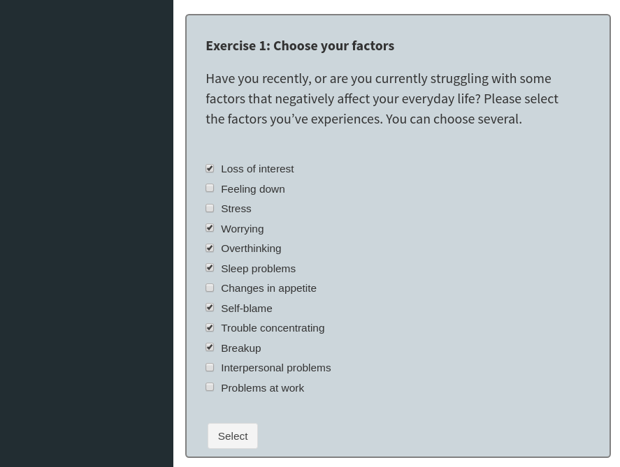
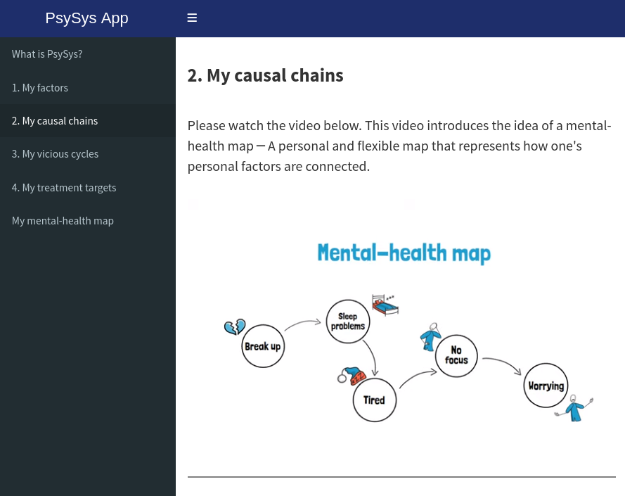
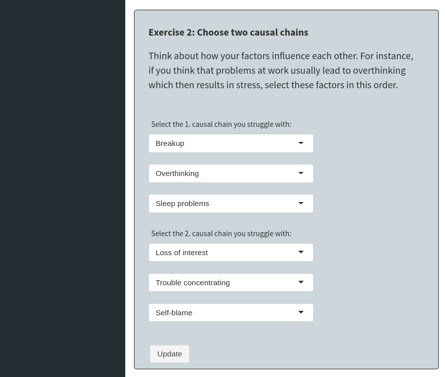
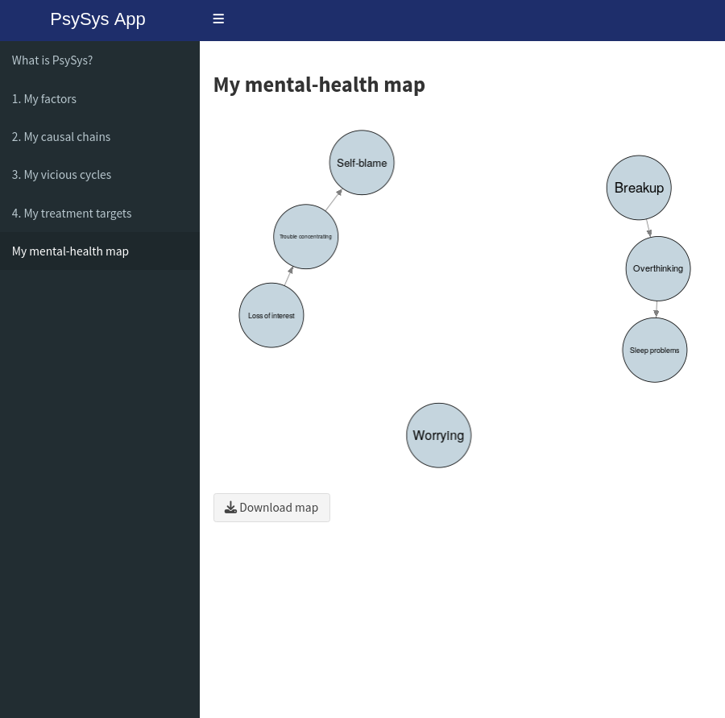
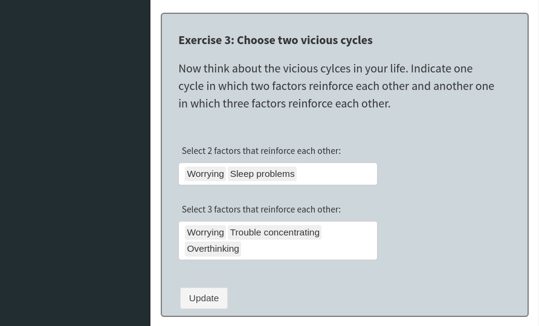
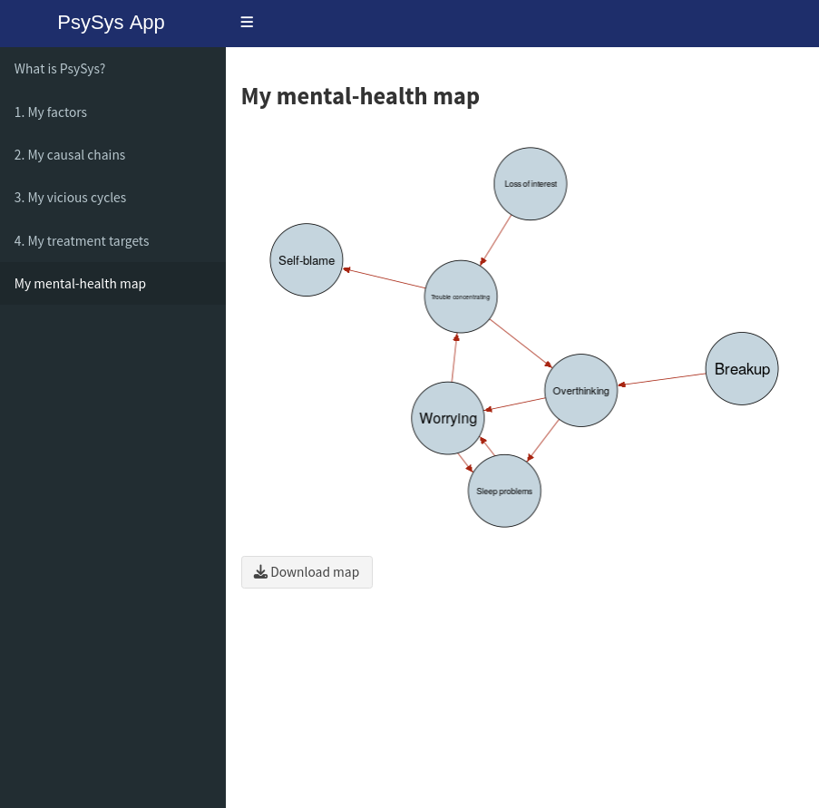

```{r, include = FALSE}
knitr::opts_chunk$set(
  collapse = TRUE,
  comment = "#>"
)
```

```{r setup, include = FALSE}
library(PsySys)
```

```{css, echo = FALSE}
body {
  line-height: 2;
}
```

The <code>PsySys</code> package harbors the PsySys R shiny app. PsySys - Psychological Systems Education - is a network-informed psychoeducation which is aimed to help the user to better understand and deal with their mental health. The app is designed to enable an interactive learning experience in which the user creates their own mental-health map by working through four blocks, each consisting of a short educational video and a small exercise.  

In the following I will give the reader a short overview into the science and rationale behind PsySys, and provide a small demonstration of its usage. If only interested in its use, the reader is advised to skip the following section and to move directly on to the demonstration. 

## The Rationale behind PsySys 

Over the past decade, the network approach to psychopathology has gained considerable attention within the scientific community as an alternative way to conceptualize and study mental disorders (Robinaugh et al., 2020). In contrast to the predominant common cause model postulating that a given disorder causes a set of observed symptoms, the network approach focuses on the dynamic interplay between the symptoms that is thought to give rise to, and maintain, the disorder (Borsboom, 2008). Thereby, the network approach breaks down clear disorder boundaries, which has proven fruitful in better understanding not only the heterogeneous structure but also the observed co-morbidity in various mental disorders (Fried et al., 2017).

Most applications of the network approach in practice have relied on the estimation and analysis of personalized networks, aimed at reforming patient-centered care (Burger et al., 2020). However, the considerable limitations of the corresponding statistical methods, mainly linked to the extensive data they require, result in a high participant burden, and thereby complicate their applicability. An alternative method to examine symptom relations has been proposed with Perceived 
Causal Relationship (PCR) scaling (Frewen, Allen, Lanius, & Neufeld, 2012). Instead of taking on a data-driven approach, PCR scaling relies on the individuals perceptions to create symptom networks. After identifying the set of symptoms they are currently dealing with, respondents go through each symptom pair $s_{i,j}$ to indicate the perceived relations between them, thereby iteratively building their own network. While the PCR method offers a promising alternative to data-driven network estimation techniques, existing clinically adapted versions of the method, such as the PECAN questionnaire (Klintwall et al., 2021), are characterized by a repetitive structure which has been met with increasing dissatisfaction among respondents. Thus, there is the need to explore alternative, more user-friendly, PCR implementations to improve its clinical utility.

The PsySys app represents a software application which allows users to build their perceived causal network as part of a modular learning experience. Thereby, it extends existing methods to build PCR networks in the following ways. Firstly, it is implemented in a modular way and therefore allows for a less repetitive structure. Secondly, it generates the network in the background, thereby providing direct visual feedback. These new features in combination with the educational videos, allow for a stand-alone and self-explanatory application that could be used in both research and clinical practice. 

## PsySys Demonstration

The app is designed as an intuitive step-by-step learning experience and the user is provided with instructions. The information provided in the following demonstration aims to give the reader a small insight into the apps' design and overall functionality.

The <code>PsySys</code> package contains ten functions: One function to start the app and nine functions that enable the mental-health updates at each stage of the PsySys session. All functions are available to the user, they however only need to make use of the <code>startPsySys</code> function to open the app. In case the reader is interested in the remaining functions, they are referred to the <code>PsySys</code> documentation. 

The PsySys app is a multi-page shiny application which includes six pages. The instruction page, four pages corresponding to the psychoeducation blocks each containing a video and an exercise, and an output page displaying the PCR network (hereinafter: mental-health map). After each exercise, the user input is included into the map and displayed on the output page. The user is also given the option to download their map. In the following the reader will be guided through an example.
\
\
\newpage
**Start PsySys:** To open up the application the user needs to run <code>startPsySys()</code>.
\
\
**Instructions:** The user is provided with a mini instructional video and some additional information. 
\
\
```{r echo=FALSE, out.width="60%", fig.align="center"}

```
```{r echo=FALSE, out.width="60%", fig.cap="The instructional page.", fig.align="center"}

```
\
\
\newpage
**Factor Selection:** In the first block **_1. My factors_** the user watches a video emphasizing the heterogeneity of symptom profiles and gets to choose a set of factors they are currently dealing with. In this example, the user chose the factors _Loss of interest, Worrying, Overthinking, Sleep problems, Self-blame, Trouble concentrating,_ and _Breakup_. After clicking on the button "Save", these factors are displayed under **_My mental-health map_**. 
\
\
```{r echo=FALSE, out.width="60%", fig.align="center"}

```
```{r echo=FALSE, out.width="60%", fig.cap="Block 1: My factors.", fig.align="center"}

```
```{r echo=FALSE, out.width="60%", fig.cap="Mental-health map after factor selection.", fig.align="center"}
knitr::include_graphics("PsySys_screenshots/map_01.png")
```
\
\
\newpage
**Causal Chains**: In the second block **_2. My causal chains_** the user watches a video introducing the idea that factors may influence each other in a mental-health map, and gets to indicate two causal chains they struggle with. The previously selected factors are displayed in a drop down menu. Once the user selects a factor, it is excluded from the remaining drop down menus of the chain to avoid cycles. In this example, the first causal chain consists of _Breakup &rarr; Overthinking &rarr; Sleep problems_ and the second causal chain consists of _Loss of interest &rarr; Trouble concentrating &rarr; Self-blame_. After clicking on the button "Update", the corresponding connections between the factors are included under **_My mental-health map_**.
\
\
```{r echo=FALSE, out.width="60%", fig.align="center"}

```
```{r echo=FALSE, out.width="60%", fig.cap="Block 2: My causal chains.", fig.align="center"}

```
```{r echo=FALSE, out.width="60%", fig.cap="Mental-health map after including causal chains.", fig.align="center"}

```
\
\
\newpage
**Vicious Cycles:** In the third block **_3. My vicious cycles_** the user watches a video explaining that factors can reinforce each other in vicious cycles, and gets to indicate two cycles they struggle with. For the first cycle, the user can indicate two factors and for the second one three factors respectively. In this example, the first cycle consists of _Worrying, Sleep problems_ and the second one of _Worrying, Trouble concentrating, Overthinking_. After clicking on the button "Update" the corresponding connections are shown in red under **_My mental-health map_** to represent reinforcing connections.
\
\
```{r echo=FALSE, out.width="60%", fig.align="center"}
knitr::include_graphics("PsySys_screenshots/page3_01.png")
```
```{r echo=FALSE, out.width="60%", fig.cap="Block 3: My vicious cycles.", fig.align="center"}

```
```{r echo=FALSE, out.width="60%", fig.cap="Mental-health map after including vicious cycles.", fig.align="center"}

```
\
\
\newpage
**Tweaking the Map:** After exercise 3, the user is presented with a pop-up text message drawing attention to the possibility of further edit the map under **_My mental-health map_** before continuing to the next section. Now, there is the option to add new factors and connections into, or delete existing factors and connections from, the map. In this example, the user added _Procrastinating_ as a new factor, and the connection _Trouble concentrating &rarr; Procrastinating_ to the map. 
\
\
```{r echo=FALSE, out.width="60%", fig.align="center"}
knitr::include_graphics("PsySys_screenshots/page3_pop-up.png")
```
```{r echo=FALSE, out.width="60%", fig.cap="Directly editing the map.", fig.align="center"}

```
\
\
\newpage
**Treatment Targets**: In the fourth block **_4. My treatment targets_** the user watches a video explaining how mental-health maps can help to identify promising treatment targets, and is asked to indicate which of their own factors would count as such. In this example, the user selected _Worrying_ as a promising treatment target based on their map. After clicking on the button "Update", the user gets a pop-up text message indicating the end of the PsySys session. This message also mentions the most influential treatment target(s) in the map regarding out-degree centrality, i.e. the number of out-going connections from the factor. The user's selected treatment target is highlighted under **_My mental-health map_**.
\
\
```{r echo=FALSE, out.width="60%", fig.align="center"}
knitr::include_graphics("PsySys_screenshots/page4_01.png")
```
```{r echo=FALSE, out.width="60%", fig.align="center"}
knitr::include_graphics("PsySys_screenshots/page4_02.png")
```
```{r echo=FALSE, out.width="60%", fig.cap="Block 4: My treatment targets.", fig.align="center"}

```
```{r echo=FALSE, out.width="60%", fig.cap="Mental-health map after highlighting a treatment target.", fig.align="center"}

```
\
\
The user can switch back and forth between the pages and each change in either Block 2 or 3 will result in an updated map. Editing the initial factor selection is treated as a "restart", where the previous information of Block 2 and 3 is lost. The mental-health map can be downloaded at any given time, thereby allowing the user to save different stages of their progress.

### References
  Borsboom, D. (2008). Psychometric perspectives on diagnostic systems. _Journal of Clinical Psychology, 64 (9)_, 1089–1108.

  Burger, J., van der Veen, D. C., Robinaugh, D. J., Quax, R., Riese, H., Schoevers, R. A., & Epskamp, S. (2020). Bridging the gap between complexity science and clinical practice by formalizing idiographic theories: a computational model of functional analysis. _BMC medicine, 18 (1)_, 1–18.
 
  Frewen, P. A., Allen, S. L., Lanius, R. A., & Neufeld, R. W. (2012). Perceived causal relations: novel methodology for assessing client attributions about causal associations between variables including symptoms and functional impairment. _Assessment, 19 (4)_, 480–493.
 
  Fried, E. I., van Borkulo, C. D., Cramer, A. O., Boschloo, L., Schoevers, R. A., & Borsboom, D. (2017). Mental disorders as networks of problems: a review of recent insights. _Social psychiatry and psychiatric epidemiology, 52 (1)_, 1–10.
 
  Klintwall, L., Bellander, M., & Cervin, M. (2021). Perceived causal problem networks: Reliability, central problems, and clinical utility for depression. _Assessment_, 10731911211039281.
 
  Robinaugh, D. J., Hoekstra, R. H., Toner, E. R., & Borsboom, D. (2020). The network approach to psychopathology: A review of the literature 2008–2018 and an agenda for future research. _Psychological Medicine, 50 (3)_, 353–366.
